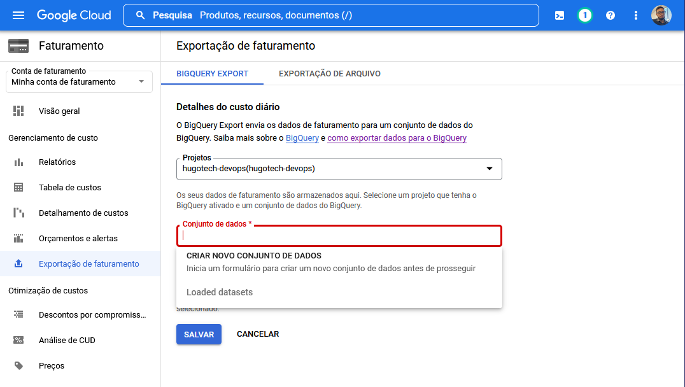
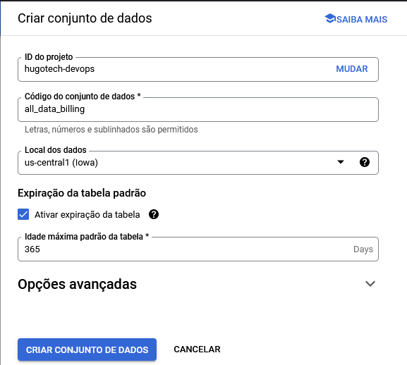
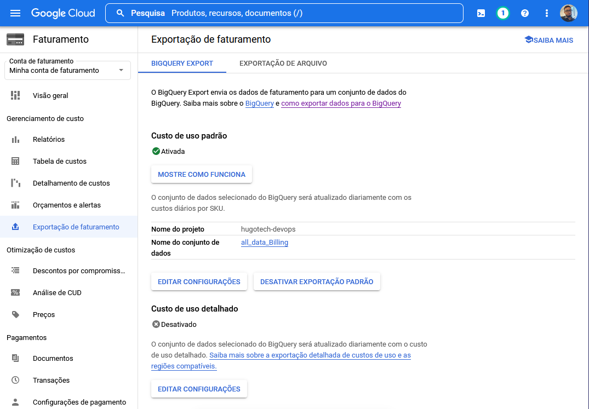

# Exportação de Dados de Faturamento (BigQuery Export)

Para realizar a exportação dos dados de faturamento siga os passo a seguir:

1. Acesse o console do google cloud pelo link [https://console.cloud.google.com/](https://console.cloud.google.com/)
2. Acesse o projeto que deseja exportar os dados de faturamento
3. Abra o menu lateral à direita e clique em Faturamento
4. No menu lateral à esquerda, na aba de Faturamento, clique em Exportação de faturamento
5. Na aba Custo de uso padrão, clique em Editar Configuração
6. Em conjunto de dados, clique em criar novo conjunto de dados como mostra a imagem abaixo

7. Selecione o id do projeto
8. Crie um id para o conjunto de dados
9. Selecione o local dos dados
10. (Opcional) Ative uma expiração para os dados. A configuração do novo conjunto de dados deve se asssemelhar à imagem abaixo:

11. Salve a exportação de faturamento

A tela de exportação de custo de uso padrão deve se assemelhar à imagem abaixo
