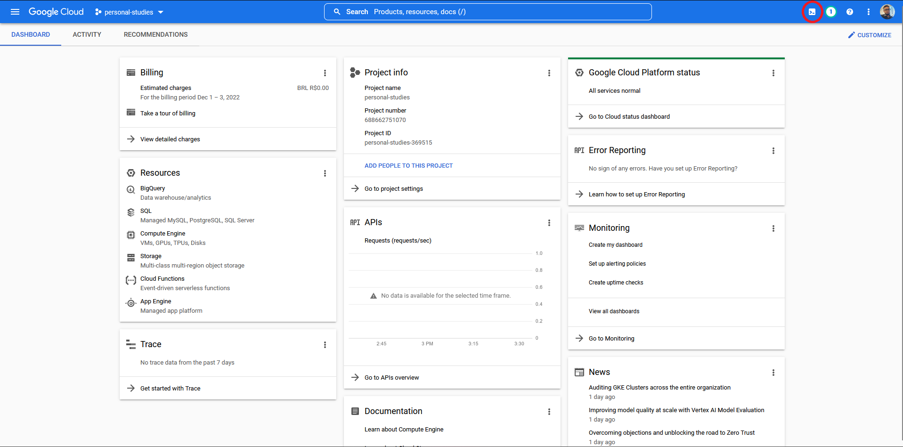
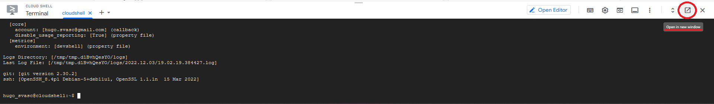
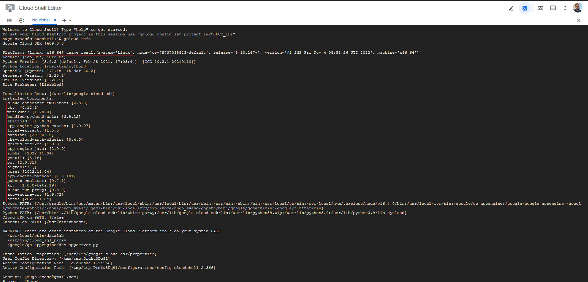
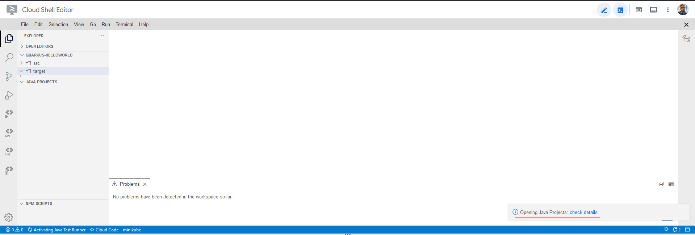
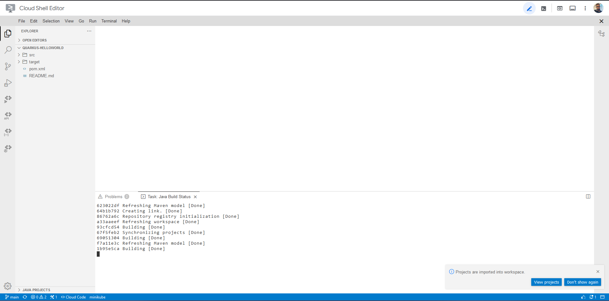
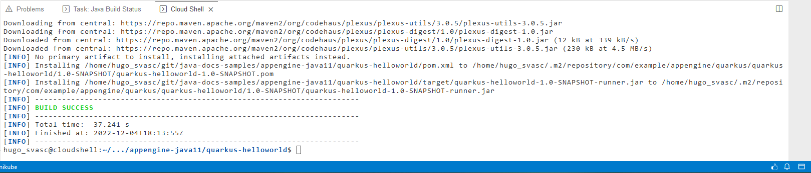
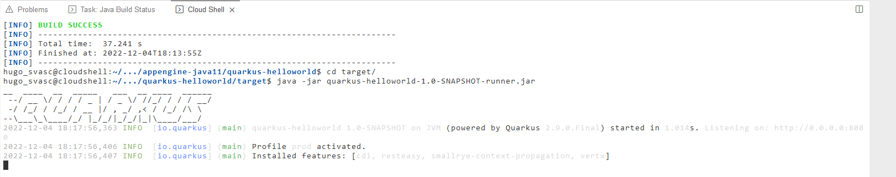
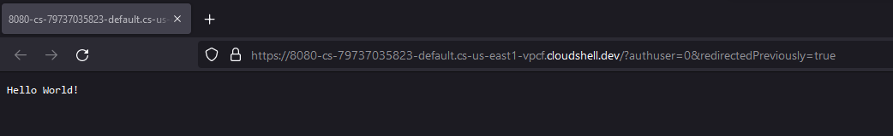

# GCP Cloud Shell

Interface de Linha de Comando preparada com todas as bibliotecas comuns para uso do Google Cloud

Também há integrado um editor para facilitar a criação/edição de códigos na máquina provisionada para uso do cloud shell.

## Utilizando o Cloud Shell

Para utilizar o Cloud Shell, basta clicar em seu ícone na barra superior do console do GCP, como mostra a imagem abaixo:

Para ter uma visualização melhor, é possível abri-lo em uma nova janela clicando no ícone indicado na imagem abaixo:

Como o cloudshell tem todas as bibliotecas necessárias para uso do GCP, podemos verificar suas informações utilizando o comando ``gcloud info``, e informações sobre a instância provisionada serão obtidas, como o sitema operacional da mesma, e componentes instalados.

## Exemplo utilizando uma aplicação Java

A aplicação a ser utilizada na exemplificação se encontra no github do próprio GCP através do link [https://github.com/GoogleCloudPlatform/java-docs-samples](https://github.com/GoogleCloudPlatform/java-docs-samples)

A aplicação será clonada para dentro da instância do Cloud Shell utilizando o comando ``git clone https://github.com/GoogleCloudPlatform/java-docs-samples``

Entraremos no diretório da aplicação com o comand ``cd java-docs-samples/appengine-java11/quarkus-helloworld/``

Ao abrirmos a pasta do projeto com o editor de código do Cloud Shell o próprio editor identifica a aplicação e instala suas dependências.

Para prosseguir com a instalção do projeto, executamos o comando ``mvn clea install``

Por fim, entramos no diretório target com o comando ``cd target`` e executamos o comando ``java -jar quarkus-helloworld-1.0-SNAPSHOT-runner.jar`` para rodar a aplicação.

Percebe-se que a aplicação está rodando com sucesso ao acessa-la no link forncedio
