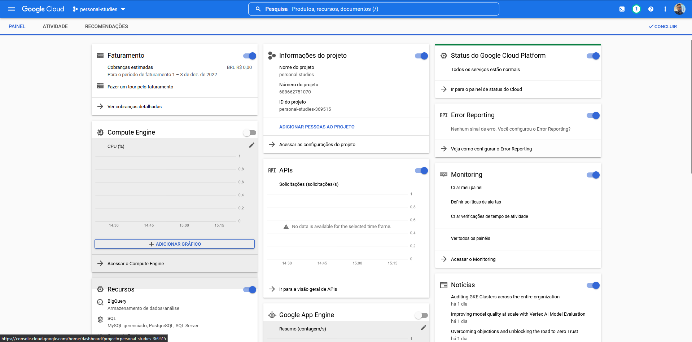
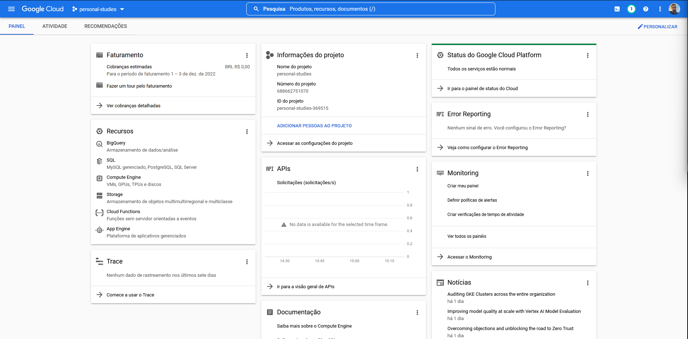
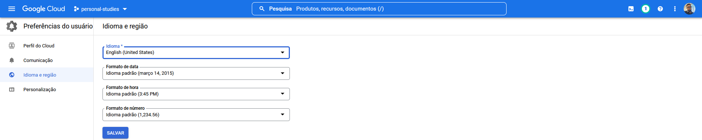
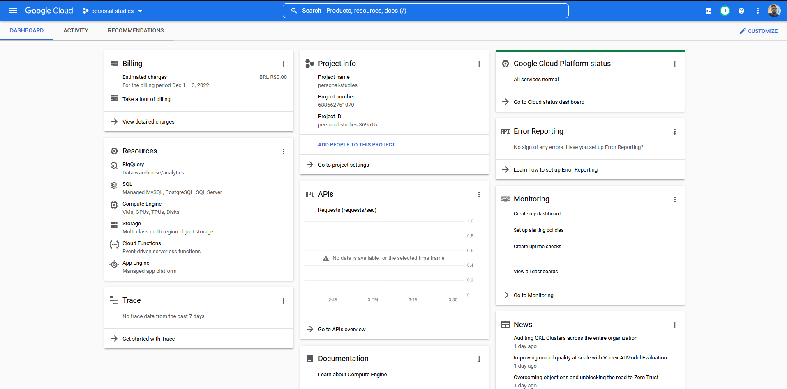

# Personalizando o Painel do seu Projeto no GCP

1. Para personalizar o painel do seu projeto no gcp acesse a console do google, clique em personalizar no canto superior direito da tela e então personalize como desejar.

Veja abaixo minha personalização, de acordo com os recursos que uso mais frequentemente:

2. Já para alteração no idioma do painel do GCP, basta clicar nos três pontinhos, ao lado da sua foto, ou foto da organização, no canto superior direito da tela, clicar em preferências. Clicar em Idioma e região no menu lateral esquerdo, e depois, alterar para o idioma desejado.

## Meu dashboard após as modificações

